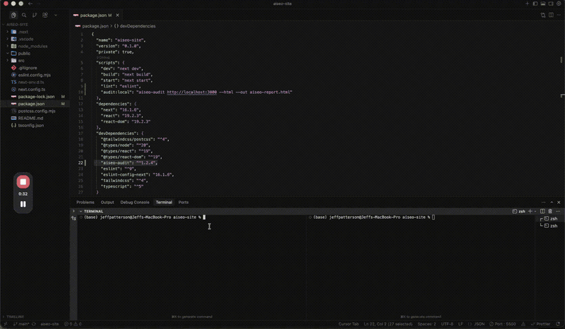

# aiseo-audit

[](https://www.npmjs.com/package/aiseo-audit)
[](LICENSE)
[](https://nodejs.org)
[](https://github.com/agencyenterprise/aiseo-audit/actions/workflows/ci.yml)
[](https://codecov.io/gh/agencyenterprise/aiseo-audit)

**A deterministic, Lighthouse-style audit for AI search readiness.** Test how easily generative engines can fetch, extract, understand, and reuse a web page.

AI SEO measures content readiness, not traditional search rank. The score is a research-informed heuristic audit, not a citation probability or a promise that an engine will cite the page.

[Website & guides](https://aiseo-audit.com/) · [Quick start](#quick-start) · [CI/CD](#cicd) · [AI assistants](#use-with-ai-assistants-mcp) · [Library API](docs/API.md) · [Scoring methodology](docs/AUDIT_BREAKDOWN.md)

## Quick Start

Requires Node.js 20.19 or later.

```bash
npx aiseo-audit https://yoursite.com
```

No install or API key is required. Analysis runs locally with no AI API calls or telemetry. Network access is limited to the page, the sitemap, and domain-signal files such as `robots.txt` and `llms.txt`.

Typical output begins with the overall score, pipeline stages, and highest-impact fixes:

```text
Overall Score: 68/100  Grade: D+

Pipeline Stages:
  Technical Eligibility    PASS 96%
  Retrieval Alignment           58%
  Citation Fitness              63%
  Provenance                    42%

Top fixes:
  1. Topic Consistency  (Entity Clarity)
  2. Citation Patterns  (Grounding Signals)
  3. Lead Summary       (Answerability)
```

<div align="center">
  
</div>

For a project-local CLI installation:

```bash
npm install --save-dev aiseo-audit
```

Install it as a regular dependency when using the [programmatic API](docs/API.md), or globally with `npm install -g aiseo-audit`.

## Why aiseo-audit?

- **Content analysis, not tag detection.** Reads the page the way an engine would: does it name its subject consistently, answer questions directly, back claims with sources, and keep boilerplate out of the way? 50+ factors.
- **Evidence-tiered scoring.** Every factor is labeled supported, conditional, heuristic, diagnostic, or experimental and mapped to the reviewed literature in [docs/EVIDENCE.md](docs/EVIDENCE.md).
- **Pipeline-stage reporting.** See whether the main constraint is technical eligibility, retrieval alignment, citation fitness, or provenance.
- **Deterministic and inspectable.** The same tool version, configuration, and fetched HTML produce the same score. Weights and thresholds are documented rather than hidden behind an external service.
- **Multiple ways to run.** Use the CLI, GitHub Action, MCP server, or typed TypeScript API; render terminal, JSON, Markdown, or standalone HTML reports.

## Common Workflows

### Audit against target queries

Query-aware audits measure three things: query terms in structural fields such as the title and headings, query terms in the body text, and a section of the page addressing each aspect of the query. Supply about five queries for a stable measurement; the maximum is ten.

```bash
npx aiseo-audit https://example.com/guide \
  --query "how to set up sso" \
  --query "saml vs oidc" \
  --query "sso troubleshooting checklist"
```

Use `--domain product` for product-specific price, specification, and comparison checks. `--engine gemini|gpt|perplexity` applies experimental presets that reweight existing categories toward each engine; they add no new checks.

### Create a shareable report

The format is inferred from the output extension:

```bash
npx aiseo-audit https://example.com --out report.html
npx aiseo-audit https://example.com --out report.md
npx aiseo-audit https://example.com --out report.json
```

Use `--tldr` for only the score and top three fixes.

### Track changes over time

```bash
# First run establishes a baseline; later runs show the delta.
npx aiseo-audit https://example.com --diff

# Compare with a specific result without updating tracked history.
npx aiseo-audit https://example.com --baseline ./previous-audit.json

# Show the timeline for every tracked URL.
npx aiseo-audit --diff --all
```

`--diff` records JSON results in `./audits` by default and updates the discovered config file. See the [CLI guide](docs/CLI.md#tracking-results-over-time) before enabling it in a repository.

### Audit a sitemap

```bash
npx aiseo-audit --sitemap https://example.com/sitemap.xml --out site-report.html
```

The report includes the average score, site-wide category averages, a host-level provenance profile, and per-URL results. Sitemap indexes are supported. URLs run sequentially, so scope large sitemaps intentionally.

More recipes and every flag are documented in the [CLI guide](docs/CLI.md). For tutorials and practical implementation guidance, visit [aiseo-audit.com](https://aiseo-audit.com/).

## What the Audit Reports

Every report rolls results up into four pipeline stages:

| Stage                     | Meaning                                                                                                |
| ------------------------- | ------------------------------------------------------------------------------------------------------ |
| **Technical Eligibility** | Can the page be fetched, yield usable text, and remain accessible to at least one known AI crawler?    |
| **Retrieval Alignment**   | Do structural fields, entities, topic coverage, and structured data support retrieval?                 |
| **Citation Fitness**      | Does the in-context content provide direct, grounded, appropriately fresh material that can be reused? |
| **Provenance**            | Does the page communicate authorship, organization identity, and attribution clearly?                  |

Technical Eligibility is a gate. A fetch failure, unusable text, or blocking every known crawler caps the overall score at 25 and suppresses downstream percentages. Citation Fitness also has evidence-based negative gates for visibly stale time-sensitive content, target-query mismatch, and missing product prices.

Factors are organized into ten categories, with Query Alignment appearing only when target queries are supplied and Product Fit appearing only for product pages. The complete factor, weight, threshold, and stage mapping lives in the [Audit Breakdown](docs/AUDIT_BREAKDOWN.md).

Unscored diagnostics never affect the score. They keep observations visible when the research cannot yet justify scoring them.

### Interpreting scores

Letter grades use familiar academic score bands. They are not population percentiles, calibrated estimates of citation likelihood, or evidence that one site is “above average.” Use the score to compare the same page or page set under a stable tool version and configuration, then prioritize the highest-weight findings and re-measure.

If you use `--fail-under`, establish the threshold from your own v2 baselines rather than treating any universal score as a guaranteed passing grade.

## CI/CD

The official [GitHub Action](https://github.com/marketplace/actions/ai-seo-audit) can gate a workflow and maintain a sticky PR comment:

```yaml
name: AI SEO Audit
on:
  pull_request:

jobs:
  audit:
    runs-on: ubuntu-latest
    permissions:
      pull-requests: write
    steps:
      - uses: agencyenterprise/aiseo-audit@v2
        with:
          url: https://yoursite.com
          fail-under: 70
          comment-on-pr: true
```

Calibrate `fail-under` against your own pages before making the check blocking. A one-line CI invocation also works:

```bash
npx aiseo-audit https://yoursite.com --fail-under 70
```

## Use with AI Assistants (MCP)

The included [MCP](https://modelcontextprotocol.io) server exposes an `audit_url` tool to Cursor, Claude Desktop, Windsurf, and other MCP clients:

```json
{
  "mcpServers": {
    "aiseo-audit": {
      "command": "npx",
      "args": ["-y", "aiseo-audit-mcp"]
    }
  }
}
```

The tool accepts optional `queries` and `domain` arguments. No separate server installation is required.

## Configuration

The CLI searches upward from the current directory for `aiseo.config.json`, `.aiseo.config.json`, or `aiseo-audit.config.json`.

```json
{
  "queries": ["how to audit ai seo", "ai seo checklist"],
  "domain": "auto",
  "format": "html",
  "weights": {
    "answerability": 2,
    "groundingSignals": 2,
    "queryAlignment": 2
  }
}
```

Missing weight keys default to `1`; set a category to `0` to exclude it. See [CLI configuration](docs/CLI.md#configuration) for all fields, defaults, and examples.

## Programmatic API

```typescript
import { analyzeUrl, loadConfig, renderReport } from "aiseo-audit";

const config = await loadConfig();
const result = await analyzeUrl({ url: "https://example.com" }, config);
const html = renderReport(result, { format: "html" });

console.log(result.overallScore, result.grade);
```

The package supports ESM and CommonJS and exports the analyzer, sitemap, report, diff, configuration, and scoring types. See the [API guide](docs/API.md).

## Limitations

- **Fetched HTML, not a browser-rendered DOM.** The audit does not execute client-side JavaScript. Server-rendered and pre-rendered content is visible; content added only after page load may be missed.
- **No visual or multimodal assessment.** Layout quality, intrusive ads, visual hierarchy, and information carried only in images are outside the audit. Image `alt` text can be inspected, but pixels are not.
- **Public HTTP access is assumed.** Authentication, consent flows, personalization, bot mitigation, and geography can change what the audit receives.
- **Network responses can vary.** Determinism applies to the scoring of identical fetched inputs; redirects, dynamic HTML, experiments, and server failures can change those inputs.
- **Sitemap processing is sequential.** There is currently no CLI URL cap, so use intentionally scoped sitemaps when runtime matters.
- **Engine behavior remains nondeterministic.** A readiness score cannot predict whether a deployed engine will retrieve or cite a page for a particular answer.

## Research and Methodology

The scoring model is informed by peer-reviewed research on generative engine optimization (GEO) and generative information retrieval, including fixed-context experiments, retrieval studies, and observations of deployed engines. Evidence strength and experimental scope matter: weights and thresholds remain expert-set heuristics rather than fitted probabilities.

- [Audit Breakdown](docs/AUDIT_BREAKDOWN.md): every category, factor, band, stage, and gate
- [Evidence](docs/EVIDENCE.md): factor-to-evidence traceability and evidence tiers
- [Emerging Research](docs/EMERGING_RESEARCH.md): cross-paper synthesis and maintenance policy
- [Paper Reviews](docs/paper-reviews/README.md): primary-source reviews behind the current model

## Migrating from 1.x

Version 2.0 rescored the factor set, so the same page will usually receive a different score. Re-baseline key pages and recalibrate CI thresholds before changing a GitHub Action from `@v1` to `@v2`. Existing 1.x config and baseline data remain readable, but the JSON emitted by `--tldr` changed shape.

See the complete [2.0 migration guide](docs/MIGRATION-2.0.md).

## Documentation

- [Website and guides](https://aiseo-audit.com/)
- [CLI and configuration](docs/CLI.md)
- [Programmatic API](docs/API.md)
- [Scoring methodology](docs/AUDIT_BREAKDOWN.md)
- [Evidence map](docs/EVIDENCE.md)
- [Research synthesis](docs/EMERGING_RESEARCH.md)
- [Future work](docs/FUTURE_PHASES.md)
- [Changelog](CHANGELOG.md)

## Contributing

See [CONTRIBUTING.md](CONTRIBUTING.md) for development setup, project structure, and pull request guidelines. Security issues should follow [SECURITY.md](SECURITY.md).

## License

[MIT](LICENSE)
